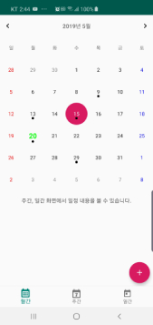
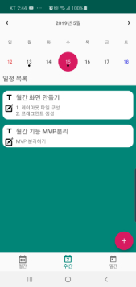
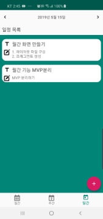
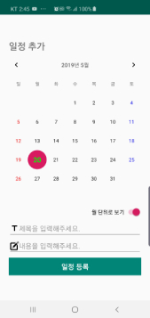

# 2019 섬머코딩 캘린더 (Android)
2019 섬머코딩 2차 과제로 주어진 캘린더 만들기 저장소입니다.
***
### __모바일 앱을 테스트할 수 있는 URL__

:link: [Appetize.io](https://appetize.io/app/dw834g133yu9fwk7juxzr9q9pr?device=nexus5&scale=75&orientation=portrait&osVersion=8.1)

__:speaker: 특이사항__

__안드로이드 실제 디바이스 및 에뮬레이터에서 API 21(Android 5.0) 까지 이상없이 구동__ 되는 것을 확인하였습니다. 하지만 Appetize.io에서 테스트시 __API 23(Android 6.0)이하는 구동되지 않아__ 문제점을 찾아보고 있습니다.

__:iphone: 실물 테스트 기기__
* 갤럭시 s10 5g (Android 9.0)
* 갤럭시 s4 (Android 5.0)
***
### PreView

### __사용 기술 스택 및 라이브러리__

* Kotlin
* Room
* Coroutine
* MVP Architecture
* Material Calendar
* Toasty

***
### __:seedling: 기능 요구사항__

1. 화면은 스플래시(인트로), 캘린더, 스케줄 등록 3개로 구성
2. 스플래시 화면에서 1.3초후 캘린더 화면으로 진입
3. 캘린더 화면은 월간, 주간, 일간으로 나뉜 탭 메뉴로 구성
4. 캘린더 앱의 첫 실행 시 화면은 월간이고, 그 이후에는 마지막 사용 했던 화면이 나타난다.
5. 캘린더는 항상 현재(오늘)를 기준으로 표시한다.
6. 캘린더는 이전 달/주/일, 다음 달/주/일로 이동할 수 있다.
7. 캘린더에는 등록한 스케쥴이 표시된다. (Monthly의 경우 스케줄 존재여부만 표시)
8. 스케줄 등록시 특정 일에 대한 일정을 저장하고, 시간 정보는 제공하지 않는다.
9. 스케줄은 내부 DB에 저장한다.
***
### __:seedling: 성능 요구사항__

1. 앱 이용 시 발생하는 오류 사항을 최소화한다.
2. 오류 발생 시 사용자가 이해하기 쉽게 표시한다.
3. 다른 사람이 읽기 쉬운 코드를 작성한다.
4. 사용할 수 있는 최신 구조와 기술을 사용한다.

***

### __:seedling: 인터페이스 요구사항__

1. 직관적이고 의미 전달이 명확한 화면을 사용자에게 제공한다.

***

# Reference

### Coroutine
* [Kotlin Coroutines을 알아보고, 안드로이드에 library 적용하기 by Taehwan](https://thdev.tech/kotlin/2018/10/04/Kotlin-Coroutines/)
* [DroidKnights 2018 도창욱 Kotlin 코루틴은 어떻게 동작하는가?](https://www.youtube.com/watch?v=usaD7HyN598&list=PLu8dnNjU2FmtyTZppzuJJEN-RH0dVw8tb&index=2)
* [Android Google Architecture Github](https://github.com/dmytrodanylyk/android-architecture/tree/todo-mvp-kotlin-coroutines)
* [Room 🔗 Coroutines](https://medium.com/androiddevelopers/room-coroutines-422b786dc4c5)

### Room
* [Android Architecture Components — Room and Kotlin](https://medium.com/mindorks/android-architecture-components-room-and-kotlin-f7b725c8d1d)

***
